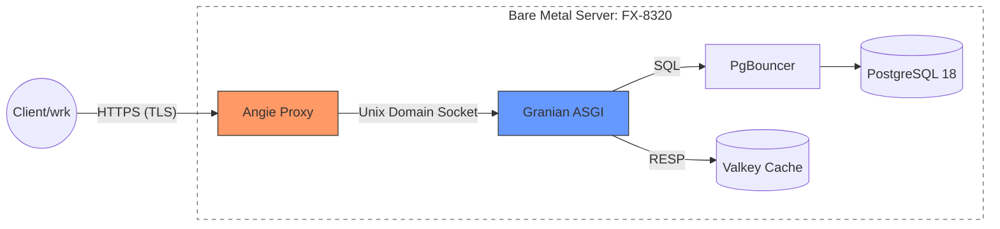

# Load Testing Report: IronTrack Baseline
**Test Date:** January 4, 2026  

**Project:** IronTrack (High-performance ASGI Backend)    
**Author:** Alexander  
**Environment:** Debian 12 (Bare Metal)

---

## 1. Test Bench Specification

**CPU:** AMD FX-8320 (8 cores, 8 threads)  
**Memory:** 12 GB DDR3  
**Storage:** HDD 7200 RPM (SATA III)  
**OS Kernel:** Linux 6.1.x (Debian Bookworm)  

**Software Stack:**
- Python 3.12.6
- PostgreSQL 18.0 & PgBouncer 1.23.1
- Angie 1.11.0
- Valkey (Redis-compatible)
- Granian 2.6.0 & Uvicorn 0.38.0

---

## 2. Launch Commands and Tuning

### System Settings
```bash
ulimit -n 65535
sudo sysctl -w net.core.rmem_max=2500000
sudo sysctl -w net.core.wmem_max=2500000
```

### Angie (Reverse Proxy)
Modify the configuration to prevent the proxy from throttling the benchmarking tool:
```nginx
location / {
    # Comment out rate limits for load testing
    # limit_req zone=api_limit burst=30 nodelay;
    # limit_conn addr_limit 20;
}

upstream app_backend {
    # Set max_fails=0 to prevent Angie from marking the backend as "down" under stress
    server unix:/run/app/granian.sock max_fails=0;
}
```

### SSL certificate generation (mkcert)
```bash
# Install local CA
mkcert -install

# Generate certificates for the app.localhost domain
mkdir -p deploy/certs
mkcert -cert-file deploy/certs/local-cert.pem -key-file deploy/certs/local-key.pem app.localhost localhost 127.0.0.1 ::1
```

### ASGI Server Parameters

**Granian**
```bash
granian src.app.main:app \
  --interface asgi \
  --host 127.0.0.1 \
  --port 8000 \
  --workers 8 \
  --runtime-threads 2 \
  --runtime-mode mt \
  --loop uvloop \
  --backlog 2048
```

**Uvicorn**
```bash
uvicorn src.app.main:app \
  --host 127.0.0.1 \
  --port 8000 \
  --workers 8 \
  --loop uvloop \
  --http httptools
```

---

## 3. Testing Methodology (wrk)

| Scenario | Endpoint                | Threads | Connections | Goal                                 |
|----------|-------------------------|---------|-------------|--------------------------------------|
| Light    | `/ping`                 | 8       | 100         | Raw ASGI & Logging overhead          |
| Medium   | `/health`               | 8       | 100         | Full Stack (App+DB+Cache) Liveness   |
| Medium   | `/api/v1/access/me`     | 8       | 100         | Cache (Valkey RESP) & JWT Validation |
| Heavy    | `/api/v1/access/signup` | 8       | 20          | Argon2id (pwdlib) & HDD I/O          |

### Example run commands:
```bash
# 1. Basic throughput test
# Goal: Measure raw ASGI adapter and logging performance without DB load.
wrk -t8 -c100 -d30s --latency http://127.0.0.1:8000/ping

# 2. App + DB + Cache integration test
# Goal: Ensure there are no delays when querying dependencies.
wrk -t8 -c100 -d30s --latency http://127.0.0.1:8000/health

# 3. Authorized access test
# Goal: Measure JWT validation performance and session retrieval from Valkey.
wrk -t8 -c100 -d30s --latency -H 'Cookie: access_token="YOUR_TOKEN"' \
  http://127.0.0.1:8000/api/v1/access/me

# 4. Signup test (heavy CPU-bound scenario)
# Goal: Measure Argon2id performance (via pwdlib) and HDD write speed.
# 20 connections are used to minimize context switching on 8 cores.
wrk -t8 -c20 -d30s --latency -s benchmarks/scripts/signup.lua \
  http://127.0.0.1:8000/api/v1/access/signup

# 5. Proxy test (HTTPS + UDS)
# Goal: Evaluate TLS overhead and Unix Socket transport efficiency (Angie).
wrk -t8 -c100 -d30s --latency -H 'Cookie: access_token="YOUR_TOKEN"' \
  https://app.localhost/api/v1/access/me
wrk -t8 -c20 -d30s --latency -s benchmarks/scripts/signup.lua \
  https://app.localhost/api/v1/access/signup
```

## 4. Scenario A: Direct Connection (Direct HTTP)

Requests are sent directly to Granian/Uvicorn: `http://127.0.0.1:8000`

### 4.1 Results: Light Load (GET /ping)
Check of ASGI adapter and middleware logging.

| Metric       | Granian (mt) | Uvicorn (uvloop) | Difference              |
|--------------|--------------|------------------|-------------------------|
| Requests/sec | 5720.75      | 4703.84          | +21.6% (Granian)        |
| Avg Latency  | 20.32 ms     | 22.25 ms         | -8.6% (Granian faster)  |
| Max Latency  | 179.70 ms    | 200.58 ms        | Granian more stable     |
| P99 Latency  | 126.78 ms    | 120.49 ms        | Uvicorn slightly better |

### 4.2 Results: Medium Load (GET /health)
Requests to PostgreSQL (SELECT 1) and Redis (PING).

| Metric       | Granian (mt) | Uvicorn (uvloop) | Difference                |
|--------------|--------------|------------------|---------------------------|
| Requests/sec | 1465.83      | 1615.45          | +149.6 RPS (Uvicorn)      |
| Avg Latency  | 74.69 ms     | 78.29 ms         | Granian faster on average |
| P99 Latency  | 459.40 ms    | 859.29 ms        | Granian 1.8x better       |
| Errors       | 53 timeouts  | 0                | Uvicorn more reliable     |

### 4.3 Results: Cache Read (GET /api/v1/access/me)
JWT + Valkey session retrieval.

| Metric       | Granian (mt) | Uvicorn (uvloop) | Difference          |
|--------------|--------------|------------------|---------------------|
| Requests/sec | 1404.72      | 1613.55          | +208 RPS (Uvicorn)  |
| Avg Latency  | 77.46 ms     | 60.07 ms         | Uvicorn faster      |
| Max Latency  | 696.02 ms    | 262.98 ms        | Uvicorn more stable |
| P99 Latency  | 279.11 ms    | 143.95 ms        | Uvicorn 2x better   |

### 4.4 Results: Heavy Load (POST /api/v1/access/signup)
Argon2id hashing + HDD 7200 RPM write. (Clean DB tables).

| Metric                | Granian (mt) | Uvicorn (uvloop) | Difference          |
|-----------------------|--------------|------------------|---------------------|
| Successful DB inserts | 409          | 384              | +6.5% (Granian)     |
| Requests/sec (wrk)    | 13.06        | 12.23            | Granian faster      |
| Avg Latency           | 863.10 ms    | 970.68 ms        | -107 ms (Granian)   |
| P99 Latency           | 1.68 s       | 1.98 s           | Granian more stable |

**Database Note:** Index cleanup is critical. With accumulated data (~700 rows), RPS drops from 13.06 to 10.30.

---

## 5. Scenario B: Proxy Mode (Angie + UDS + HTTPS)

Comparison of direct HTTP (Granian) versus HTTPS via Unix Domain Sockets.

Requests are sent through: `https://app.localhost`



| Endpoint              | Metric       | Granian (Direct) | Angie + Granian | Difference         |
|-----------------------|--------------|------------------|-----------------|--------------------|
| /ping                 | Requests/sec | 5720.75          | 1335.62         | SSL/Proxy overhead |
| /api/v1/access/me     | Requests/sec | 1404.72          | 653.51          | SSL/Proxy overhead |
| /api/v1/access/signup | Avg Latency  | 863.10 ms        | 756.44 ms       | -12% (Faster)      |
| /api/v1/access/signup | P50 (Median) | 610.45 ms        | 539.70 ms       | -11.5% (Faster)    |
| /api/v1/access/signup | DB inserts   | 409              | 350             | SSL overhead       |

---

## Baseline: IronTrack Performance Summary

**Goal:** Comparison of Granian vs Uvicorn and evaluation of benefits from Angie (UDS/HTTPS).  
**Test Bench:** FX-8320 / 12 GB RAM / HDD 7200 RPM / Debian 12.

### Key Findings

- **CPU-heavy (Argon2id):** Granian (`--runtime-mode mt`) leads. +6.5% DB inserts (409 vs 384). Uvicorn hits core contention earlier.
- **I/O & Cache (Valkey):** Uvicorn is more stable. +15% RPS on profile reads (`/me`) and 2x better tail latency (P99 143 ms vs 279 ms for Granian).
- **Infrastructure (Angie):** Proxying via Unix Sockets (UDS) reduced latency by 12% (from 863 ms to 756 ms), partially compensating SSL overhead.
- **Disk Bottleneck:** HDD 7200 RPM is a critical factor. Increased latency during writes and index page updates (I/O wait) reduces RPS by 21% (from 13.06 to 10.30) even with small data volumes.
- **Planner Misconfiguration Impact**: Initially, an aggressive random_page_cost (1.1) was tested. However, results showed a significant 21% performance degradation on HDD storage during index-intensive operations (/signup). The configuration was subsequently corrected to 3.0, aligning the PostgreSQL query planner with the physical capabilities of the 7200 RPM drive and resulting in more stable latency.
